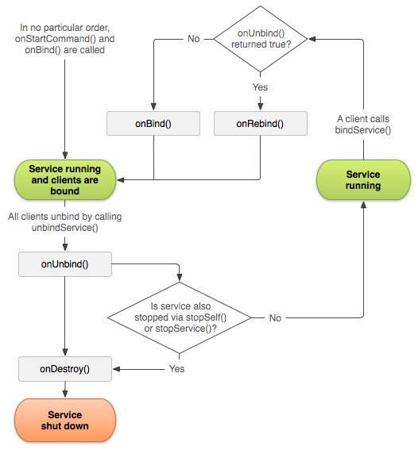

10 речей які Ви не знали про Service в Android
==============================================

Дання статья є перекладом [10 things you didn’t know about Android’s Service](https://medium.com/@workingkills/10-things-didn-t-know-about-android-s-service-component-a2880b74b2b3#.jr6udnlod)

1. Service це не "покращений AsyncTask".
---------------------------------------

Майте на увазі, що кожен Service це спеціальний компонент, який має вартість, не тільки для вашого,
але і для всієї системи.

2. Service за замовчуванням запускається у головному потоці, в тому самому процесі в якому виконується Ваш додаток.
-------------------------------------------------------------------------------------------------------------------

При бажанні ви можете запустити його в іншому процесі, але ви повинні уникати цього, якщо це не є абсолютно необхідно, і ви розумієте, всі витрати, пов'язані з цим.

3. У IntentService немає ніякої магії.
-------------------------------------

Він працює шляхом створення [HandlerThread](https://developer.android.com/reference/android/os/HandlerThread.html) на якому він ставить в чергу роботу яка має бути
виконана, підхід, яки легко можете бути використаний за межами *Service*.

Це простий клас, завздовжки лише 167 рядків(74 без коментарів), Ви [може це перевірити](https://github.com/android/platform_frameworks_base/blob/master/core/java/android/app/IntentService.java).

4. В один і той самий час, може існувати лише один екземпляр Service.
--------------------------------------------------------------------

Незалежно від того, як Ви його створюєте, може існувати лише один екземпляр Service в один і той самий час, навіть тоді, коли зовнішні додатки/процеси взаємодіють з ним.

5. Service може бути дуже просто вбитий.
---------------------------------------

Ви можете позначити його як процесс передього, але робити це тільки тоді, коли це абсолютно необхідно.

Зверніть увагу, що коли Ваш код виконується всередині  [*onCreate()*](https://developer.android.com/reference/android/app/Service.html#onCreate%28%29), [*onStartCommand()*](https://developer.android.com/reference/android/app/Service.html#onStartCommand%28android.content.Intent,%20int,%20int%29), чи [*onDestroy()*](https://developer.android.com/reference/android/app/Service.html#onDestroy%28%29), він розглядається системою, так, якщо б він був на передньому плані, навіть якщо це не так.

Дивіться [тут](https://developer.android.com/guide/components/processes-and-threads.html#Lifecycle), щоб зрозуміти, наскільки велика ймовірність того, що Ваш процес може бути вбитий.

6. Service може бути “started”, “bound”, або обидва одночасно.
--------------------------------------------------------------

Також зверніть увагу, що незалежно від того, скільки разів Ви викликаєте [*startService()*](https://developer.android.com/reference/android/content/Context.html#startService%28android.content.Intent%29), один виклик [*stopService()*](https://developer.android.com/reference/android/content/Context.html#stopService%28android.content.Intent%29) чи [*stopSelf()*](https://developer.android.com/reference/android/app/Service.html#stopSelf%28%29) зупинить його.

Зверніть увагу на цю корисну таблицю:

	
	 
  	Життєвий цикл

7. START_FLAG_REDELIVERY дозволяє уникнути втрати вхідних даних.
----------------------------------------------------------------

При передачі даних під час запуску *Service*, повертаючи прапор [START_FLAG_REDELIVERY](https://developer.android.com/reference/android/app/Service.html#START_FLAG_REDELIVERY) у [onStartCommand()](https://developer.android.com/reference/android/app/Service.html#onStartCommand%28android.content.Intent,%20int,%20int%29) надає можливість уникати втрати данних, у випадку якщо *Service* буде вбитий у процесі їх обробки.

8. Повідомлення переднього плану можуть бути частково приховані.
----------------------------------------------------------------

*Service* переднього плану(foreground) повинен показати постійне повідомлення, але ви можете встановити йому [*PRIORITY_MIN*](https://developer.android.com/reference/android/app/Notification.html#PRIORITY_MIN) щоб приховати його з рядка стану(status bar) (повідомлення все одно буде видно в шторці повідомлень). 

9. Service може запускати Activity.
-----------------------------------

Як і будь-який *Context*, який не є *Activity*, ви можете запускати *Activity* зі *Service*, якщо Ви додаєте прапор [FLAG_ACTIVITY_NEW_TASK](https://developer.android.com/reference/android/content/Intent.html#FLAG_ACTIVITY_NEW_TASK).

Ви можете також показати [Toast](https://developer.android.com/guide/topics/ui/notifiers/toasts.html) або [Status Bar](https://developer.android.com/guide/topics/ui/notifiers/notifications.html) повідомлення.

10. Ви маєте можливість використовувати принцип єдиної відповідальності.
------------------------------------------------------------------------

Це неймовірно, Ви не повинні реалізовувати бізнес-логіку в класі *Service*, натомість реалізувавши її в окремому класі. Таким чином, серед багатьох інших переваг, Ви можете запустити його в іншому місці, якщо це необхідно. Дивовижний!

 
Тепер майте цей список на увазі, поширюйте його, та допомогайти зупинити зловживання *Service*!
